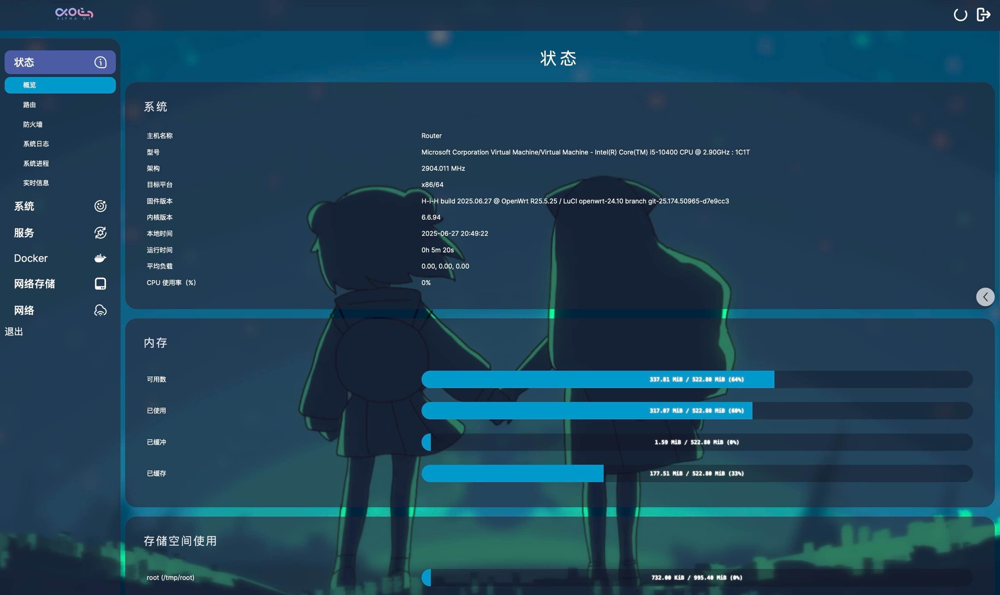
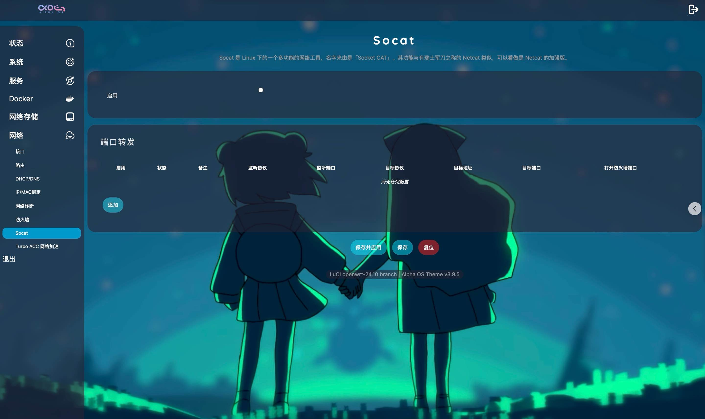
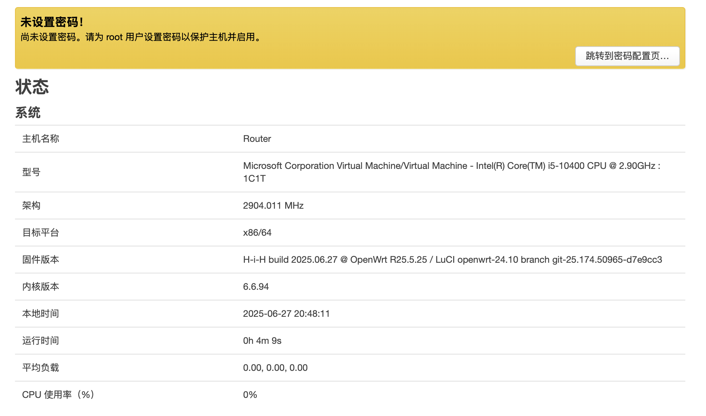

# Action Openwrt 云自动编译
⏰ **每周六00:00:00自动拉取最新源码自动编译**

[![Contributors][contributors-shield]][contributors-url]
[![Forks][forks-shield]][forks-url]
[![Stargazers][stars-shield]][stars-url]
[![Issues][issues-shield]][issues-url]
[![MIT License][license-shield]][license-url]

<br />

<p align="center">
  <a href="https://github.com/H-i-H/OpenWrts-HiH">
    
  </a>
  <h3 align="center">Openwrt/LEDE 云编译</h3>
  <p align="center">
    👉 每周定时自动拉取Openwrt最新源码编译，自动发布到 [<a herf="https://github.com/H-i-H/OpenWrts-HiH/releases"> Releases </a>]👈
    <br />
    <a href="https://github.com/H-i-H/OpenWrts-HiH"><strong>探索本项目的文档 »</strong></a>
    <br />
    <br />
    <a href="https://github.com/H-i-H/OpenWrts-HiH/releases">下载地址</a>
    ·
    <a href="https://github.com/H-i-H/OpenWrts-HiH/actions">Action</a>
    ·
    <a href="https://github.com/H-i-H/OpenWrts-HiH/issues">提出新特性</a>
  </p>

</p>

## 目录

- [Action Openwrt 云自动编译](#action-openwrt-云自动编译)
  - [目录](#目录)
  - [支持的设备](#支持的设备)
    - [🎯固件默认设置](#固件默认设置)
  - [固件特性](#固件特性)
  - [自带插件](#自带插件)
  - [文件目录说明](#文件目录说明)
  - [定制固件](#定制固件)
    - [注意事项](#注意事项)
  - [固件预览](#固件预览)
  - [版权说明](#版权说明)
  - [项目支持](#项目支持)
  - [Stargazers over time](#stargazers-over-time)

<br>


## 支持的设备
|           支持的设备        |         固类别         |        Action         |            状态          |              下载页          |
| :------------------------: | :---------------------: | :-------------------: | :-------------------: | :--------------------------: |
|             x86_64                    |  [LEDE](https://github.com/coolsnowwolf/lede) |[🍕](https://github.com/H-i-H/OpenWrts-HiH/actions/workflows/x86_64.yml) |  |  [✔](https://github.com/H-i-H/OpenWrts-HiH/releases) |
|             树莓派 3B/3B+             | [LEDE](https://github.com/coolsnowwolf/lede) | [🍕](https://github.com/H-i-H/OpenWrts-HiH/actions/workflows/RaspberryPi3.yml) |  | [✔](https://github.com/H-i-H/OpenWrts-HiH/releases) |
|             树莓派 4B             |  [LEDE](https://github.com/coolsnowwolf/lede) | [🍕](https://github.com/H-i-H/OpenWrts-HiH/actions/workflows/RaspberryPi4.yml) |  |  [✔](https://github.com/H-i-H/OpenWrts-HiH/releases) |
|             NanoPi R2S             |  [LEDE](https://github.com/coolsnowwolf/lede) | [🍕](https://github.com/H-i-H/OpenWrts-HiH/actions/workflows/Rockchip.yml) |  | [✔](https://github.com/H-i-H/OpenWrts-HiH/releases) |
|             NanoPi R4S             |  [LEDE](https://github.com/coolsnowwolf/lede) | [🍕](https://github.com/H-i-H/OpenWrts-HiH/actions/workflows/Rockchip.yml) |  | [✔](https://github.com/H-i-H/OpenWrts-HiH/releases) |
|             NanoPi R5C             |  [LEDE](https://github.com/coolsnowwolf/lede) | [🍕](https://github.com/H-i-H/OpenWrts-HiH/actions/workflows/Rockchip.yml) |  | [✔](https://github.com/H-i-H/OpenWrts-HiH/releases) |
|             NanoPi R5S             |  [LEDE](https://github.com/coolsnowwolf/lede) | [🍕](https://github.com/H-i-H/OpenWrts-HiH/actions/workflows/Rockchip.yml) |  | [✔](https://github.com/H-i-H/OpenWrts-HiH/releases) |
|             FastRhino R68S             |  [LEDE](https://github.com/coolsnowwolf/lede) | [🍕](https://github.com/H-i-H/OpenWrts-HiH/actions/workflows/Rockchip.yml) |  | [✔](https://github.com/H-i-H/OpenWrts-HiH/releases) |
|             Orange Pi R1 Plus             |  [LEDE](https://github.com/coolsnowwolf/lede) | [🍕](https://github.com/H-i-H/OpenWrts-HiH/actions/workflows/Rockchip.yml) |  | [✔](https://github.com/H-i-H/OpenWrts-HiH/releases) |

<br>

### 🎯固件默认设置
- 路由器地址: `11.11.11.1`
- 默认用户名: `root`
- 默认密码  : `无`

<br>

## 固件特性
⏰ 固件LUCI采用LEDE源码的openwrt-24.10分支

✨ 固件添加了部分常用插件

✨ Arm集成所有openwrt的USB驱动

✨ 集成Docker

✨ x86_64 vmdk固件集成vm-tools

✨ x86_64包含iso QCOW2 VDI VMDK VHDX等格式镜像

<br>

## 插件
🍕 添加插件
- 全组件PassWall
- luci-app-adguardhome
- luci-app-aria2
- luci-app-diskman
- luci-app-dockerman
- luci-app-mentohust
- luci-app-openlist
- luci-app-qbittorrent
- luci-app-socat
- luci-app-tailscale
- luci-app-transmission
- luci-app-ttyd
- luci-app-unblockneteasemusic
- luci-app-usb-printer
- luci-app-watchcat=y
......

<br>

## 文件目录说明
eg:

```
filetree
├── .github/workflows
│  ├── Rockchip.yml
│  ├── RaspberryPi3.yml
│  ├── RaspberryPi4.yml
│  ├── RaspberryPi5.yml
│  ├── x86_64.yml
│  ├── update-checker.yml
├── /configs/ (配置文件目录)   
│  ├── /luci/ (app插件配置)   
│  |  ├── xxx.config (配置)
│  ├── RPi3.config
│  ├── RPi4.config
│  ├── RPi5.config
│  ├── Rockchip.config
├── feeds.sh (feeds.conf.default文件配置)
├── config-package.sh (feeds后的插件、主题添加及参数配置)

Tips:
x86.conf | RPi4.config - 该类型配置文件主要为机型配置文件
```
<br>

## 定制固件
1. Fork 此项目
2. 按需修改 ```feeds.sh``` 和 ```config-package.sh``` 文件
3. 上传你自己的 ```xx.config``` 配置文件到configs目录
4. 添加或修改自己的``````xx.yml``````文件
5. 最后根据个人喜好修改 ```update-checker.yml``` 需自行添加 ```Actions secrets``` (触发自动编译)

### 注意事项：
📌 修改feeds.conf.default文件 👉 ```feeds.sh```   
📌 添加其它Luci插件或修改参数 👉 ```config-package.sh```   
📌 插件 / 应用配置文件 👉 ```configs/software.config```   
<br>

## 固件预览
**主界面(luci-theme-alpha)：**


**服务/插件：**


**网络：**


**主界面(luci-theme-bootstrap)：**



## 版权说明

该项目签署了MIT 授权许可，详情请参阅 [LICENSE](https://github.com/H-i-H/OpenWrts-HiH/blob/main/LICENSE)


## 鸣谢
- [P3TERX/Actions-OpenWrt](https://github.com/P3TERX/Actions-OpenWrt)
- [coolsnowwolf/lede](https://github.com/coolsnowwolf/lede)
- [bigbugcc/OpenWrts](https://github.com/bigbugcc/OpenWrts)
- [derisamedia/luci-theme-alpha](https://github.com/derisamedia/luci-theme-alpha)

## Stargazers over time
[](https://starchart.cc/H-i-H/OpenWrts-HiH)

<!-- links -->
[your-project-path]:https://github.com/H-i-H/OpenWrts-HiH/
[contributors-shield]: https://img.shields.io/github/contributors/H-i-H/OpenWrts-HiH?style=flat-square
[contributors-url]: https://github.com/H-i-H/OpenWrts-HiH/graphs/contributors
[forks-shield]: https://img.shields.io/github/forks/H-i-H/OpenWrts-HiH?style=flat-square
[forks-url]: https://github.com/H-i-H/OpenWrts-HiH/network/members
[stars-shield]: https://img.shields.io/github/stars/H-i-H/OpenWrts-HiH?style=flat-square
[stars-url]: https://github.com/H-i-H/OpenWrts-HiH/stargazers
[issues-shield]: https://img.shields.io/github/issues/H-i-H/OpenWrts-HiH?style=flat-square
[issues-url]: https://img.shields.io/github/issues/H-i-H/OpenWrts-HiH
[license-shield]: https://img.shields.io/github/license/H-i-H/OpenWrts-HiH?style=flat-square
[license-url]: https://github.com/H-i-H/OpenWrts-HiH/blob/master/LICENSE
